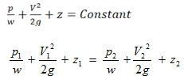
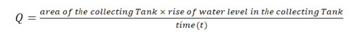
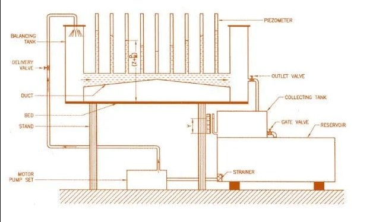

### Theory

Bernoulli’s equation states that:
“In an ideal, incompressible fluid flow when the flow is steady and continuous, the sum of pressure energy, kinetic energy and potential energy is constant along a stream line”.

Mathematical Representation, 
	 

	 

Assumptions: It may be mentioned that the following assumptions are made in the derivation of Bernoulli’s equation.

1.	The liquid is ideal and incompressible.
2.	The flow is steady and continuous.
3.	The flow is along the streamline, i.e. it is one-dimensional.
4.	The velocity is uniform over the section and is equal to the mean velocity.
5.	The only forces acting on the fluid are the gravity forces and the pressure forces.

Rate of flow or Actual Discharge (Q): 

The water flowing through the section of a pipe or a channel under the steady state conditions is collected in a collecting tank for a known time t. The rise of water level in the collecting tank is noted down. The actual discharge is 

<h5>Experimental Figure</h5>

