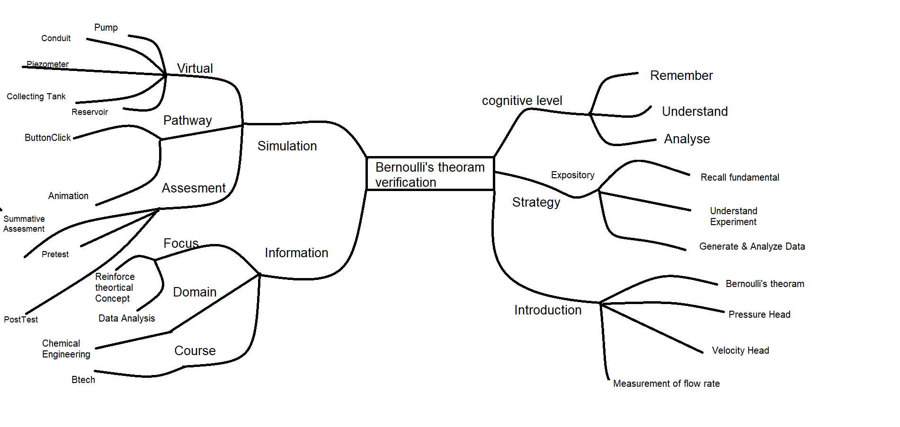
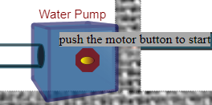
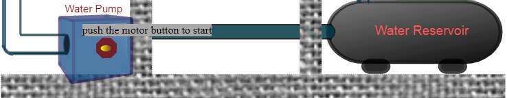
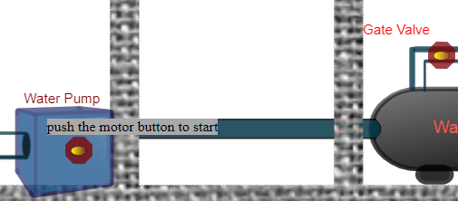
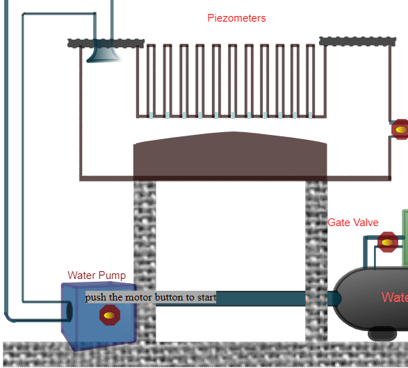
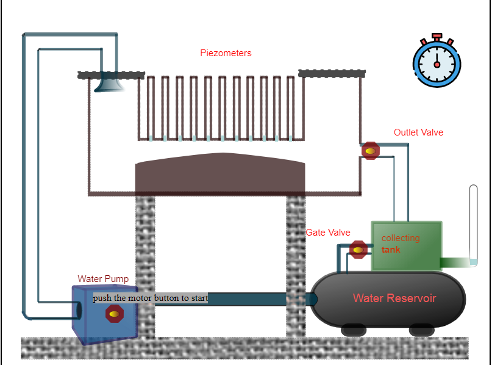
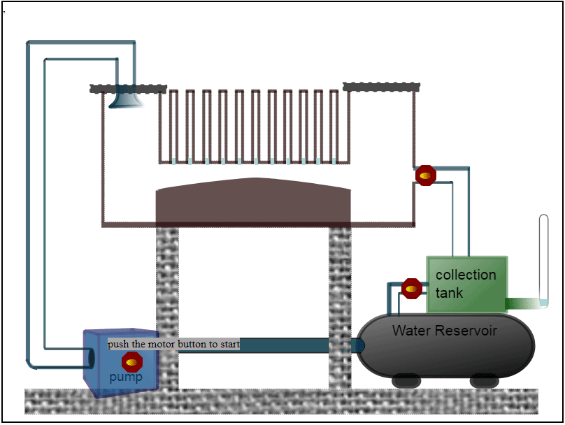

## Storyboard (Round 2)

Experiment 1: Study and verification of the flow pattern in bernoulli's apparatus.

### 1. Story Outline:

This experiment involves water that will circulate from the reservoir by the help of pump through the delivery pipe, conduit and piping arrangement, collecting tank then to reservoir again. Between the conduit in the pipe there are piezometers attached at equal distance. 
The objective of the experiment is to recall the Bernoulli's theorem and verify that.

### 2. Story:

First user will switch on the motor. Then water will start to flow from reservoir through delivery pipe to the delivery valve. Then user will open the delivery valve and flow of water occurs which fill the tank, conduit and pipe simultaneously. Once conduit is filled open the outlet valve.
Then user will regulate the flow rate by using outlet valve. Meanwhile piezometers will start filling up to a certain height. Height of each piezometer is demonstrated and recorded by the user. 
Now user will close the gate valve, fluid will start filling in collecting tank. After 30 seconds final height will appear on the simulator and this height will be recorded by the user for calculating flow rate of water through the valve

#### 2.1 Set the Visual Stage Description:
In the simulator user will be able to see the virtual prototype of experimental set up resembling the actual experimental set up that is present in real time labs.
Set up consists of a Reservoir tank containing large amount of volume connected to a centrifugal pump by the help of 2 cm diameter pipe. The outlet of the pump is also connected with 2 cm diameter vertical pipe, attached to the conduit. There is a delivery valve present in between delivery pipe connecting to the conduit1. The outlet pipe of variable diameter just like venturimeter is connected from the bottom of conduit1 to the conduit2 know as duct. In the duct at regular intervals piezometers are attached for measuring pressure head. 11 piezometers are present in  duct of length 900 mm.
At the outlet of the conduit2 there is  outlet valve for regulating the flow rate through the duct. Then from the conduit 2 a pipe is attached that drops the water into the collecting tank. This collecting tank has dimensions of 40*40 cm2. This collecting tank also contains a attached manometer tube for measuring height in the tank. At the bottom side of collecting tank there is a gate valve which in close condition prevents the fall of water back into the reservoir. The reservoir is present just below the collecting tank.
#### 2.2 Set User Objectives & Goals:
1) By this experiment student will be able to recall the Bernoulli's theorem. 
2) This experiment Describe the application of Bernoulli's theorem.
3) Student will be able to recall the velocity head and pressure head concepts.
4) To understand the change in the pressure head when flow rate is changed through calculation.
5) To understand the calculation of flow rate by measuring height in collecting tank.
6) To plot a graph taking piezometer distances on x-axis and taking Pressure head on Y-axis.
7) Student will be able to analyse the data obtained from various sections of the pipe at different flow rates through graph.

#### 2.3 Set the Pathway Activities:

1) In the experimental set up, there is a centrifugal pump, delivery valve, outlet valve and gate valve. This all will be recognised by user as each have naming in the set up.
2) User will start the pump by clicking on the motor button.
3) Then user will on the delivery valve present at the delivery side of the pump. Also after that by the help of outlet valve user will regulate the flow rate of water through the duct.
4) Then by closing the gate valve student will be able to collect water in the collecting tank for measuring height by which student will understand the calculation of flow rate and will calculate the same.
5) Simulator will provide the respective heights of piezometer and other data needed for doing calculation.
6) User will do the calculation for pressure head, velocity head and total head. After doing all the calculation student will be able to recall Bernoulli's theorem. 
7) User will make a plot having piezometers distance on x-axis and taking Pressure head on Y-axis. 
8) By the help of graph student will be able to analyse the data obtained for different flow rates.

##### 2.4 Set Challenges and Questions/Complexity/Variations in Questions:
1) If the conduit is placed in inclined position then will the Bernoulli’s Equation will be valid? (<b>Y</b>,N) (LO1 & LO2) 
2) What pattern does the values of kinetic energy follows (LO1; LO2 and LO 3) 
a)<b>It first increases then decreases at the length of the conduit </b>. 
b)	It remains constant throughout the conduit. 
c)	It first decreases then increases at the length of the conduit. 
d)	It is zero throughout the conduit. 

##### 2.5 Allow pitfalls:
1. If user does not open outlet valve then conduit2 will overflow after sometime.
2. If user uses outlet valve just after closing gate valve and the timer is still running, user might get wrong readings.

##### 2.6 Conclusion:

User will take approximate 7-10 minutes for understanding the procedure. Then for generating data by the help of simulator will take 2-3 minutes. After onwards for calculating result and plotting graph will take 12 minutes. Hence total time taken for doing experiment will be approximately 25 minutes.

##### 2.7 Equations/formulas: 
Different formulas and equations that will be used in this are - 

<h5>Bernoulli's Theorem:</h5>
Pressure head+ Velocity head+ datum = total head = constant;
  i.e P/w +{(v2)/(2*g)} + z = Total head = constant;  
 Flow rate, Q = ( A*H)/ t ;
  
velocity, v = Q/a;

  where, 
p= pressure  
w = weight density  
g= acceleration due to gravity, 9.81 m/(s^2)  
v= Velocity in duct  
A= Area of collecting tank  
a= Area of c/s of duct  
H = height in collecting tank  
t= time for collecting water in collecting tank i.e 30seconds  

### 3. Flowchart 4
 
link to flow chart Here : https://github.com/Simulators368/Bernoulli-s-apparatus/blob/master/storyboard/flowchart/Untitled%20drawing.png
 

### 4. Mindmap:

 

### 5. Storyboard :

Step1: First we created Reservoir for continuous water supply. 
     
Step2: Then we added a pump that moves water from reservoir to the conduit.

      
Step3: Then by the help of piping pump was connected to the conduit. 

     
Step4: After That Duct and Piezometers were connected between the two conduits. 

               
Step5: Now For measuring flow rate a collecting tank was added with gate valve attached and a stopwatch was connected to record height and whole set up looks like this.br>

     

link to storyboard Here : https://github.com/Simulators368/Bernoulli-s-apparatus/blob/master/storyboard/storyboard/im.gif
